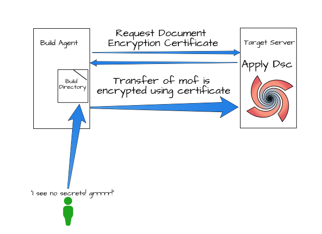

# PowerShell: Dynamic Dsc Encryption

## The Pitch

When you have a credential secret there is an issue that, at rest, on the release agent, you can find an unencrypted plaintext password of the account in the mof, adding a certificate allows you to encrypt the mof in both locations.

I have experienced this every time I need to get a new deployment up and running to a new server, with a secret involved. What I am going to show is a way to shortcut this process and get and use the certificate at run time.

if you do not secure your mof you can find secrets leaking out of your mof

## The Guidelines on Securing a mof

I generally follow the guidelines from the <a href="https://docs.microsoft.com/en-us/powershell/dsc/securemof" target="_blank" rel="noopener">microsoft documentation</a>, but found some of the steps unnecessary.

To encrypt a Dsc process you follow the usual instructions:

- connect to a server,
- generate a document encryption certificate,
- export certificate,
- transfer certificate to authoring server,
- install certificate on authoring server,
- copy certificate to central store,
- add reference to thumbprint and certificate location on Dsc Template and ConfigurationData,
- Run the job.

What confused me was the need for the certificate to get registered against the authoring server, but also referencing a central store for the certificate, even though it gets imported into the local machine certificate store; turns out this isn't needed!

The only steps needed are Getting the certificate to the authoring server, not installing or saving it to a central store, and providing the thumbprint.

## The Process

For a secure mof, you will need:

- a Certificate file, and filepath, for the Target Node
- a Thumbprint based on the certificate file
- a CertificateID for the LocalConfigurationManager, which comes from the certificate thumbprint.

As configurationData is nothing more complicated than a hashtable, loading the information into memory allows modifications as needed.

Here is an example ConfigData file:

I am defining a `CertificateFile`, with the prefix of the `NodeName`, this isn't the path to the file, but more a pointer to the file. We need to get the certificate from the target node via a session, with some conventions like this applied this makes life a bit easer.

```powershell
@{
    AllNodes = @(
    @{NodeName = "ServersFQDN";
    Role = "WebServer"
    PSDscAllowDomainUser = $true;
    CertificateFile = "ServersFQDNDscEncryptionCert.cer"
    Thumbprint = ""
    }
)
NonNodeData = @{
    }
}
```

Loading the config into a variable allows for modifications at runtime.

```powershell
$config = Get-Content ".\Config.psd1" | Out-String | iex
```

_The location of the config.psd1 in relation to where you are running the script is important, so if you know or can define the full path do that._

### Getting the Certificate (Get-DscEncryptionCertificate)

You will need to instantiate some sessions to the target servers. In your Config, you already have that list defined. Using the `NodeName` from the array of servers in your `AllNodes`, you can create all the sessions you need and pass this to the Get function.

- **`$WorkingDirectory`** could be `$PSScriptRoot`, this the location where all the scripts are rooted.
- **`$Sessions`** an array of all the sessions created.
- **`$Suffix`** what is the name of the file, the certificate will always be prefixed with the FQDN of the server and have the extension of `cer`, the suffix relates to the `CerfificateFile`, so if you change this value it will need to be reflected there.

If you have a sever named `Server01.local` and change the suffix to be `Cert`, the Get process will generate a file called `Server01.localCert.cer`, if you havent named the `CertificateFile` property, in your Node data, the same it will not match.

```powershell
function Get-DscEncryptionCertificate {
    [CmdletBinding()]
    param (
        [Parameter(Mandatory=$true)]
        [String]
        $WorkingDirectory,
        [Parameter(Mandatory=$true)]
        [System.Management.Automation.Runspaces.PSSession[]]
        $Sessions,
        [String]
        $Suffix="DscEncryptionCert"
    )

    begin {
    }
    process {
        Invoke-Command -Session $Sessions -ScriptBlock {
            Param($Suffix)
            $FQDN = ([System.Net.Dns]::GetHostByName($env:computerName).HostName)
            $DnsName = "$FQDN$Suffix"
            # note: These steps need to be performed in an Administrator PowerShell session
            if ($null -ne (Get-ChildItem -Path cert:\LocalMachine\My | Where-Object Subject -Like CN=$DnsName)) {
                $thumbprint = Get-ChildItem -Path cert:\LocalMachine\My | Where-Object Subject -Like CN=$DnsName | Select-Object -ExpandProperty ThumbPrint
                $cert = "cert:\LocalMachine\My\$thumbprint"
            }
            else {
                $cert = New-SelfSignedCertificate -Type DocumentEncryptionCertLegacyCsp -DnsName $DnsName -HashAlgorithm SHA256
            }

            Export-Certificate -Cert $cert -FilePath "c:\temp\$($DnsName).cer"
        } -ArgumentList $Suffix

        foreach ($session in $Sessions) {
            $cn = $session.ComputerName
            Move-Item -FromSession $Session -Path "c:\temp\$($cn)$($Suffix).cer" -Destination $workingDirectory
        }
    }
    end {
    }
}
```

This process, moves all the certificates from the corresponding targets to the authoring server's working directory ready for the Use process.

### Using the certificate (Use-DscEncryptionCertificate)

The Use process is part of the Push even, you are ready to generate your mof files so now is where you will encrypt them.

The `Use-DscEncryptionCertificate` asks for:

- **`$ConfigData'** - The ConfigurationData from your process.
- **`$WorkingDirectory'** - The Root location of where the certificates are likely to be found.

```powershell
function Use-DscEncryptionCertificate {
    [CmdletBinding()]
    param(
        [HashTable]
        [parameter(Mandatory, ValueFromPipeline)]
        $ConfigData,
        [String]
        [Parameter(Mandatory)]
        $WorkingDirectory
    )

    begin {
    }

    process {
        foreach ($node in $ConfigData.AllNodes) {
            $certPath = (Join-Path $WorkingDirectory $node.CertificateFile)
            $cert = New-Object System.Security.Cryptography.X509Certificates.X509Certificate2 $certPath

            $node.Thumbprint = $cert.Thumbprint
            $node.CertificateFile = $certPath
        }
    }

    end {
    $ConfigData
    }
}
```

## And Finally

The final steps of encryption are done for you. The addition of the Thumbprint and Full Path to the certificate are added to the ConfigData by the `Use-DscEncryptionCertificate`. Here is an example of the full run from getting the sessions created, performing the Get and Use functions for the certificate, generating and applying the mof.

```powershell

# Get the location where the script is running
$location = $PSScriptRoot

# Move to that location
Set-Location $location

# Load the config file into a variable
$config = Get-Content "$location\Config.psd1" | Out-String | iex

# Generate a list of Target NodeNames
$targets = @()
$config.AllNodes | Where-Object { $_.Role -eq "WebServer" } | ForEach-Object { $targets += $_.NodeName }

# Create Sessions for all the targets.
$Sessions = New-PSSession -ComputerName $targets -Credential $deployCred

# Call the Get-DscEncryptionCertificate with the working directory of this location and provide all the sessions.
Get-DscEncryptionCertificate -WorkingDirectory $location -Sessions $Sessions

# Close all the sessions
Remove-PSSesssion $Sessions

# Update the Config data to use the certificate values generated.
$config = Use-DscEncryptionCertificate -ConfigData $config -WorkingDirectory $location

# Load the Dsc Configuration into Memory
. $location\DscConfig.ps1

# Apply the ConfigurationData to the Template, and generate the mofs
Config -ConfigurationData $config -OutputPath $location\Config -Verbose

# Create Cim sessions to target servers.
$cs = New-CimSession -ComputerName $targets -Credential $deployCred

# Start LocalConfigurationManager on Targets
Set-DscLocalConfigurationManager $location\Config -CimSession $cs  -Verbose -ErrorAction Stop

# Apply Dsc
Start-DscConfiguration -Path $location\Config -CimSession $cs -Verbose -Wait -Force  -ErrorAction Stop

# Close all Cim Sessions
Remove-CimSession -CimSession $cs
```



## Thank you for reading

Thanks for getting this far. This isnt perfect, I will probably find I have shot myself in another way, but this fits how we are working. If there are any suggestions I am more than willing to discuss.